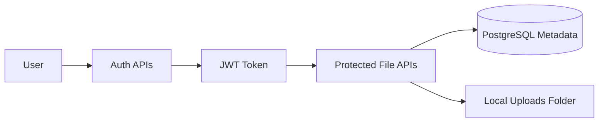

# Secure File Sharing System

A secure file sharing backend built with Spring Boot and Maven.

This project supports user registration, JWT-based login, authenticated file upload, file download, listing a user's own files, deleting owned files, and sharing files through temporary public links. File metadata is stored in PostgreSQL, while the actual uploaded files are stored in a local `uploads/` folder.

## Key Features

- User registration and login
- Password hashing with BCrypt
- JWT authentication
- Protected file APIs
- Upload files to local storage
- Store file metadata in PostgreSQL
- List files uploaded by the logged-in user
- Download only owned private files
- Delete only owned files
- Generate temporary public share links
- Expire shared links after a configured time
- Global exception handling
- Request validation using DTOs

## Tech Stack

| Layer | Technology |
| --- | --- |
| Language | Java 21 |
| Framework | Spring Boot 3 |
| Build Tool | Maven |
| Web | Spring Web |
| Security | Spring Security, JWT, BCrypt |
| Database | PostgreSQL |
| Persistence | Spring Data JPA, Hibernate |
| Utilities | Lombok |
| Validation | Jakarta Validation |

## Project Architecture

The project follows a clean layered architecture:

| Layer | Responsibility |
| --- | --- |
| `controller` | Handles HTTP requests and responses |
| `service` | Contains business logic |
| `repository` | Communicates with the database |
| `entity` | Defines database models |
| `dto` | Defines request and response objects |
| `security` | Handles JWT and authenticated user details |
| `config` | Contains application and security configuration |
| `exception` | Handles application errors globally |

## Working Diagram



## API Endpoints

| Method | Endpoint | Access | Description |
| --- | --- | --- | --- |
| `POST` | `/api/auth/register` | Public | Register a new user |
| `POST` | `/api/auth/login` | Public | Login and receive a JWT token |
| `POST` | `/api/files/upload` | Protected | Upload a file |
| `GET` | `/api/files` | Protected | List logged-in user's files |
| `GET` | `/api/files/{id}/download` | Protected | Download an owned file |
| `DELETE` | `/api/files/{id}` | Protected | Delete an owned file |
| `POST` | `/api/files/{id}/share` | Protected | Create a temporary public share link |
| `GET` | `/api/share/{token}` | Public | Download a file using a valid share token |

## Database Entities

### User

| Field | Type | Description |
| --- | --- | --- |
| `id` | `Long` | Primary key |
| `name` | `String` | User's name |
| `email` | `String` | Unique email address |
| `password` | `String` | BCrypt hashed password |
| `role` | `Role` | User role |
| `createdAt` | `LocalDateTime` | Account creation time |

### File

| Field | Type | Description |
| --- | --- | --- |
| `id` | `Long` | Primary key |
| `originalFileName` | `String` | Original uploaded filename |
| `storedFileName` | `String` | Unique stored filename |
| `fileType` | `String` | MIME type |
| `fileSize` | `Long` | File size in bytes |
| `filePath` | `String` | Local file path |
| `uploadedBy` | `User` | Owner of the file |
| `createdAt` | `LocalDateTime` | Upload time |

### Shared File Link

| Field | Type | Description |
| --- | --- | --- |
| `id` | `Long` | Primary key |
| `token` | `String` | Public share token |
| `file` | `FileEntity` | Shared file |
| `createdBy` | `User` | User who created the link |
| `expiresAt` | `LocalDateTime` | Link expiration time |
| `createdAt` | `LocalDateTime` | Link creation time |

## Setup Instructions

### 1. Clone the Project

```bash
git clone <repository-url>
cd share
```

### 2. Create PostgreSQL Database

Create a database named:

```sql
CREATE DATABASE file_sharing_db;
```

### 3. Configure Application Properties

Update `src/main/resources/application.properties` with your PostgreSQL username, password, JWT secret, and upload folder path.

### 4. Run the Application

On Windows:

```bash
mvnw.cmd spring-boot:run
```

On Linux/macOS:

```bash
./mvnw spring-boot:run
```

The API will start at:

```text
http://localhost:8080
```

## Environment Variables / application.properties Example

```properties
spring.application.name=java.share

spring.datasource.url=jdbc:postgresql://localhost:5432/file_sharing_db
spring.datasource.username=postgres
spring.datasource.password=postgres
spring.datasource.driver-class-name=org.postgresql.Driver

spring.jpa.hibernate.ddl-auto=update
spring.jpa.show-sql=true
spring.jpa.properties.hibernate.format_sql=true
spring.jpa.properties.hibernate.dialect=org.hibernate.dialect.PostgreSQLDialect

app.jwt.secret=change-this-secret-key-to-at-least-32-characters
app.jwt.expiration-ms=86400000
app.upload.dir=uploads

spring.servlet.multipart.max-file-size=20MB
spring.servlet.multipart.max-request-size=20MB
```

## Folder Structure

```text
src
└── main
    ├── java
    │   └── com.example.java.share
    │       ├── config
    │       ├── controller
    │       ├── dto
    │       ├── entity
    │       ├── exception
    │       ├── repository
    │       ├── security
    │       └── service
    └── resources
        └── application.properties
```

## Contribution Guidelines

Contributions are welcome. To contribute:

1. Fork the repository.
2. Create a new feature branch.
3. Make your changes with clear and readable code.
4. Test your changes before submitting.
5. Open a pull request with a short explanation of your changes.

Please keep the code beginner-friendly, consistent with the existing layered structure, and focused on the backend API.

## Author

**Love Kumar Chaudhary**

Project: **Secure File Sharing System**
